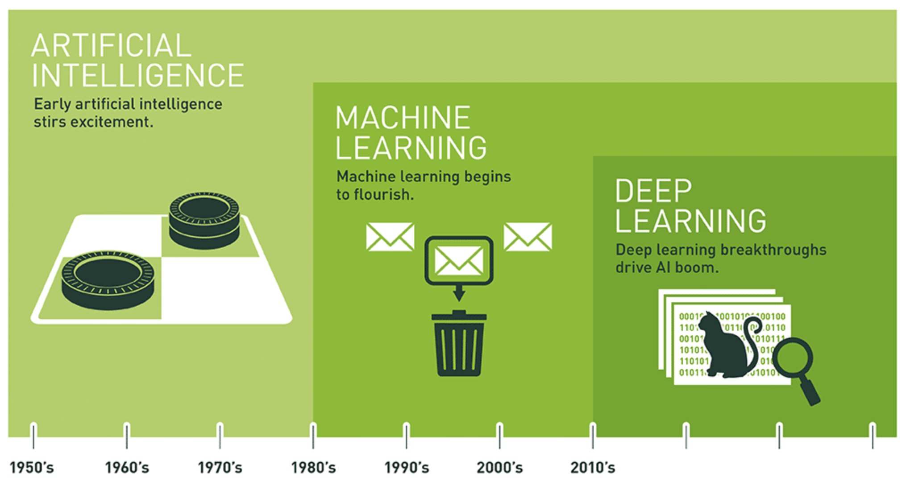
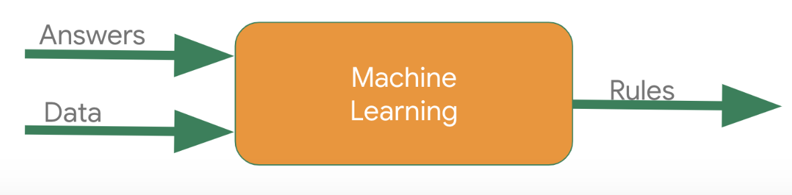
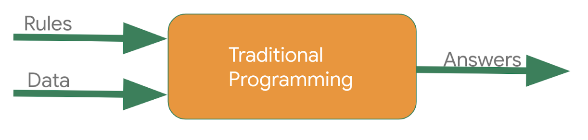
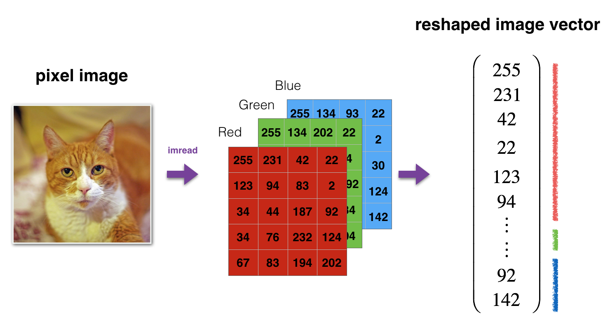
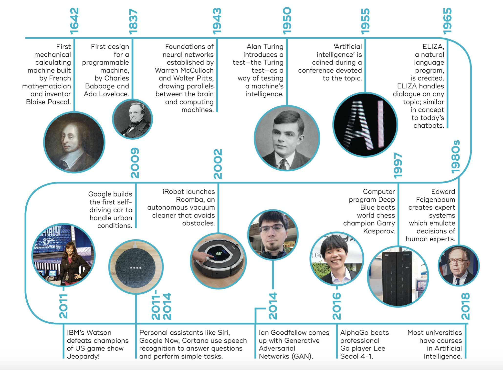

# Introduction 

The promise of Artificial Intelligence (AI) is big: from conversational chatbots, to self-driving cars, to agents achieving super-human performance at various games (Go, Dota, Starcraft) to housekeeping bots. 

The ultimate promise is strong AI or Artificial General Intelligence (AGI), which is the theoretical capacity of a system to perform any intellectual task that a human being is capable of: think of C-3PO or The Terminator. AGI is still very present in science-fiction movies, but still has yet a long way to come to reality.

What we do in this course falls under the concept of Narrow AI - technologies capable of performing specific tasks just like us, or sometimes better than us: think of face recognition, voice assistants or self-driving cars.

AI, machine learning and deep learning are common buzzwords in our daily lives, that is why it is important to start understanding what they are, how they work, what are their limitations and how they are changing our lives. 

# Definitions

In this section, you will learn what Artificial Intelligence, Machine Learning and Deep Learning

mean and how they relate to each other. 

Artificial Intelligence is “_the study of ideas which enable computers to do the things that make people seem intelligent_” (Winston, NF 1977). Many fields fall under this broad concept, one of them being Machine Learning. Even Machine Learning has other subsets, such as: Reinforcement Learning or Deep Learning.

Think of the diagram below as a semantic tree.

_Souce: https://blogs.nvidia.com/blog/2016/07/29/whats-difference-artificial-intelligence-machine-learning-deep-learning-ai/_

## Artificial Intelligence

AI is an umbrella term coined in 1955 and its purpose is at large based on the question whether computers can be made to “think”, therefore a broad definition would be as follows: “the effort to automate intellectual tasks normally performed by humans” (François Chollet in his book Deep Learning with Python).

As shown in the chart below, AI is composed of Machine Learning and Deep Learning, but also includes methods that don’t involve learning, such as heuristics or handcrafted rules. The latter approach is generally known as _symbolic AI_ and it was the primary direction in AI between 1950 and 1980.

Symbolic AI worked well for logical problems, but it proved impractical for solving complex problems, such as image classification or language translation. It was time for a new approach: _Machine Learning_.

## Machine Learning

Machine Learning is a subfield of AI that looks at classical programming from a new perspective, with the scope of learning rules from the data, rather than having programmers create these rules by hand.

The classical way of doing programming is to input these rules into a program along with data to be processed and get some answers.

The new way of programming in the machine learning paradigm is to simply change the axes. Instead of providing the rules, the programmer inputs the data and the answers expected from the data (labels), and the machine will discover (or infer) the rules.

We say that a machine learning system is _trained_, rather than programmed. This “training” is similar to the way a child learns a new concept, like what a dog is. The parent shows the child several examples (or data) of dogs, points out that “this is a dog” (answer) and congratulates them when they do it correctly.

At the end of this process, the child has gained a mental model of the dog and is capable of identifying new dogs. 

In the same manner, we say that a machine learning system learns a model of the data. Following the child learning analogy, the building blocks for doing machine learning are:

1. Input examples: Pictures of animals.
2. Output examples: Tags, such as “dog” “cat”, “frog”.
3. A way to measure if the machine learning system is doing a good job. This is how the machine learns.

A machine learning model builds up an understanding or a _representation_ of the input examples to be able to recognize different tags. In machine learning lingo, this is called a classification task. 

What is a representation? It is just another way of looking at the data. For example, a color image can be represented with various schemas, such as [RGB](https://www.lifewire.com/color-models-rgb-1697461) (red, green, blue), [CMYK](https://www.lifewire.com/about-the-cmyk-color-model-1697460) (cyan, magenta, yellow, key) or HSV (hue, saturation, value).

_Source: https://towardsdatascience.com/classifying-cat-pics-with-a-logistic-regression-model-e35dfb9159bb_

Machine learning is all about learning the most appropriate representation for the input data to solve the task at hand. Now that you know what learning is, let’s look into deep learning.

## Deep Learning

Deep Learning is a specific subfield of machine learning in which the representation of the data takes the form of successive layers, each layer learning new and increasingly complex features.

Coming back to our task of image classification, the deep learning process consists of building up a progressive understanding of the input pictures:

*   The first layer(s) learn basic features such as edges.
*   Later layers learn features such as textures or patterns.
*   The last layers learn features such as parts of objects or objects.

_Source: [https://distill.pub/2017/feature-visualization/](https://distill.pub/2017/feature-visualization/)_

At this point, you know that deep learning is about mapping inputs to outputs using a layered sequence of data representations. Concretely, for a deep learning model a cat is simply a hierarchy of increasingly abstract features, basically a combination of specific edges, textures and patterns.

The theory revolving around deep learning (you may have heard of concepts such as: computer vision or backpropagation) dates back from 1989, but the real progress has only recently started. These changes are related to several technical advancements, such as:

*   Hardware (e.g.: GPUs, TPUs)
*   Datasets and benchmarks (e.g.: ImageNet, Wikipedia)
*   Algorithmic advances (e.g.: Better Gradient Propagation) 

# Short History

Artificial Intelligence is about building intelligent machines. Before 1949 the main limitation for such an achievement was the fact that computers could not store, but only execute commands. Basically, computers could not remember what they were told to do. Also, computing was very expensive, the cost of leasing a computer could go up to $200,000 a month.

The year 1955, when the term “Artificial Intelligence” was coined, marked the beginning of a new era of development, driven by great optimism and expectations. 

From 1956 to 1973, AI flourished and gave some first impressive results (e.g.: ELIZA). This was the first AI summer. 

After 1974, funders began to lose trust in the power of AI. AI winter came and lasted up until 1980. 

After 1980 AI was reignited by an increase in funding, popularizing the expert systems or rules based systems capable of solving real-world problems.

Unexpectedly, in the absence of government funding during 1990-2000, AI succeeded. A remarkable landmark is the defeat of world chess champion Gary Kasparov by IBM’s Deep Blue, a computer program. 

We now live in a time where AI is everywhere, steadily improving and impacting our lifestyle. 

Source: [https://qbi.uq.edu.au/brain/intelligent-machines/history-artificial-intelligence](https://qbi.uq.edu.au/brain/intelligent-machines/history-artificial-intelligence)

# Machine Learning Skills

You have probably realized by now that Machine Learning is an interdisciplinary field. As with any growing discipline, the skill set required to do Machine Learning is also evolving. 

Before going into some widely accepted definitions of these skills, it is important to mention that the popularity of Machine Learning has been greatly influenced by the democratization of the tools used in the field. Nowadays, basic Python skills can be sufficient to do research in machine learning. There are even visual tools that empower you to quickly get familiar with this discipline, or plug-and-play tools that automate machine learning model developments. You will learn about these tools in the next chapters.

A generic overview of the skills required to do Machine Learning is provided in the Venn diagram below. As you can see Machine Learning sits at the intersection between Hacking Skills (which is just a fancy name for creative coding) and Math & Statistics Knowledge (which is how you analyze data).

_Source: [http://drewconway.com/zia/2013/3/26/the-data-science-venn-diagram](http://drewconway.com/zia/2013/3/26/the-data-science-venn-diagram)_

A more industry specific approach is given by Martin Zinkevichin in the guide “[Rules of Machine Learning](https://developers.google.com/machine-learning/guides/rules-of-ml)”, where he explains that most of the challenges of a machine learning project are engineering problems and gives this advice: “_do machine learning like the great engineer you are, not like the great machine learning expert you aren’t**”.**_

# Machine Learning Workflow

Doing Machine Learning is an iterative process and requires a specific mindset: running several experiments to find a suitable model.

_Source: _[https://developers.google.com/machine-learning/problem-framing](https://developers.google.com/machine-learning/problem-framing)
