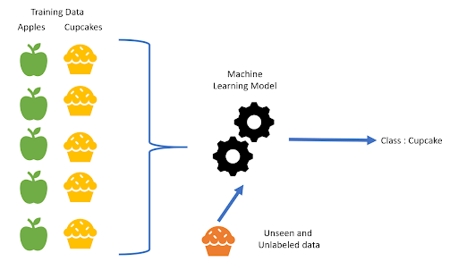
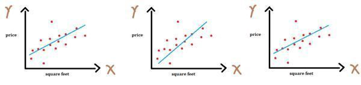
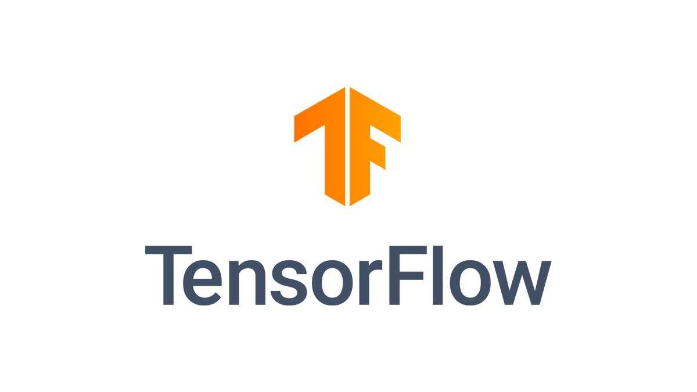
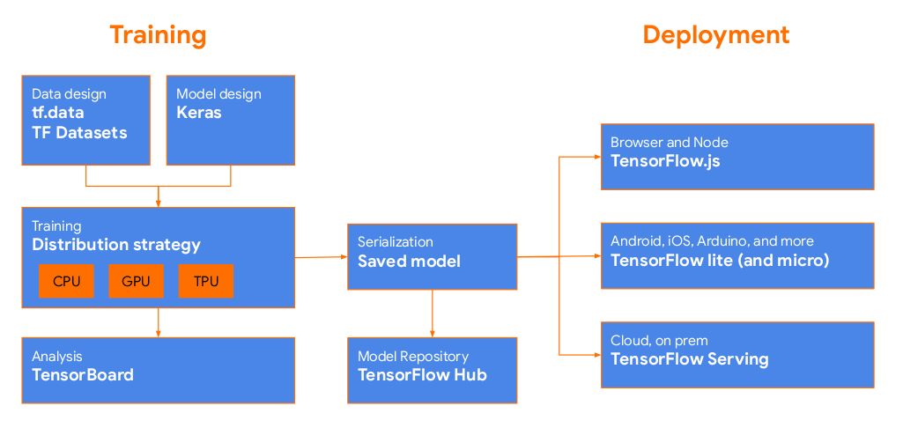
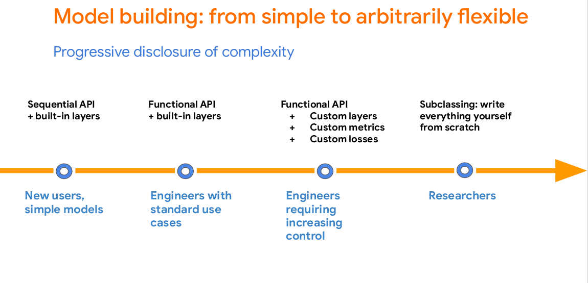
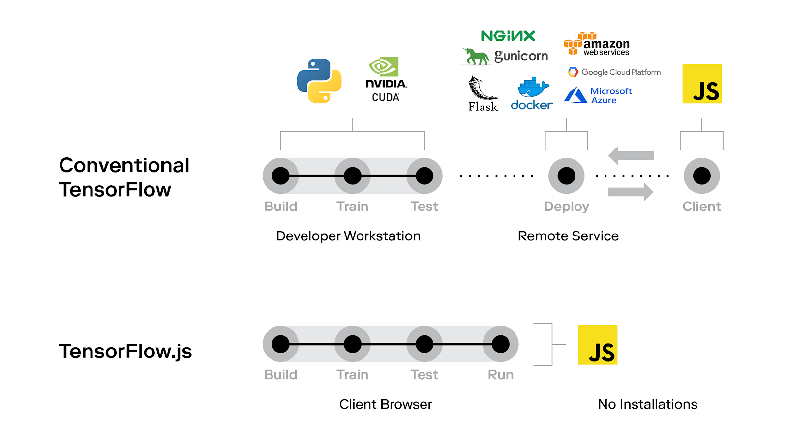
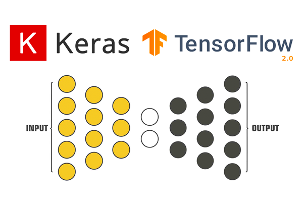

# Machine Learning Fundamentals

  * [Artificial Intelligence](#Artificial-Intelligence)
    * Definition: overall introduction using the fourth quadrants, and then general categories problem solving, knowledge, reasoning and planning and learning and perciving and acting i.e. robotics
    * Foundation
    * History
  * Machine Learning
    * Solving problem without algorithms
      * Supervised vs unsupervised
      * Parametric vs nonparametrics (i.e automl) learning
    * Fundamental topics
      * Neural Networks
      * Gradient Descent
      * Backpropagation
      * Feature Engineering
      * Overfitting and underfitting: from memorization to generalization
      * Activation Function
    * Machine Learning Workflow
    * Popular examples
      * Sequential 
      * LSTM
    * Federated Learning
  * TensorFlow 2
    * What is TensorFlow?
      * Easy model building
      * Robust ML production anywhere
      * Powerful for research
    * Keras
      * Sequential API
      * Functional API
    * Components
      * Tensorflow Datasets
      * Tensorflow Hub
      * Model Garden
    * Use cases

## Artificial Intelligence

Have you meet intelligent entities?
  * We have been looking for Artificial Intelligent entities since 1957.
  * Actually, since then AI has been always a hot topic for scientist and engineers

But what are they? Based on [S. Russell and P. Norvig 2016](../05%20References/README.md)
**Human Performance** | **Human Rationality**
----------------- | ------------------
Thinking Humanly  | Thinking Rationally
Acting Humanly    | Thinking Rationally

According to the [Wikipedia entry](https://en.wikipedia.org/wiki/Artificial_intelligence), The field of AI research was born during a workshop at Dartmouth College in 1956.
The term "Artificial Intelligence" was coined by John McCarthy, inventor of Lisp programming language. 
The list of participants in that workshop includes several of the most important computer scienctist ever, 
such as Marvin Minsky, Claude Shannon, Julian Bigelow, W McCulloch, John Nash or Herbert A. Simon.

Since then, the AI discipline has evolved, including now several categories covering:

  * **Reasoning and problem solving**, including deterministics algorithms but also heuristics and probabilistics approaches.
  * **Knowledge representation and expert systems**, with special importance of the semantic modeling of knowledge.
  * **Planning** activities for intelligent agents, cooperation and competition among them and emergent behavior i.e evolutionary algorithms and swarm intelligence. 
  * **Learning**, in particular, machine learning, deep learning and statistical learning. In this course, we will focused in deep learning.
  * **Natural language processing**, i.e. the computatinal ability to understand human language.
  * **Perception**, in particular speech recognition or computational vision, using sensors perciving i.e. feeling the elements of the world.
  * **Motion and Manipulation**, in particular apply to robotics.

In the last 60 years, there have been recurrent hypes about the artificial intelligence and machine learning.
The current significan development of the field might be related to several aspect:

  * An eficient training algorithms for neural networks. See [Rumelhart, D.E., Hinton, G.E. and Williams, R.J. 1986](../05%20References/README.md).
  * Cheap hardware and cloud platforms.
  * Open source and collaborative research, such as [Arxiv](https://arxiv.org/) or [Kaggle](https://www.kaggle.com/)
  * Masive digitalization of our world contributing to the production of huge amount of training data.

## Machine Learning

Link: https://docs.google.com/document/d/10TD3dHNesN6buXOvuRMEY55HC6MbGWCa69MgbnKIX3c/edit?usp=sharing

### Solving Problems without Algorithms
The difference in Machine Learning and general algorithmic approach is that algorithms give out a definite answer. While machine learning tries to approximate an answer. So traditionally we give rules and input and produce an answer. But in Machine Learning we give input and answer to get the rules to answer for unseen input.

To understand this in a bit more detail, let’s take an example. 

The answer to this is easy. We made a general rule on our own. But what if we are given to convert Celsius to Fahrenheit without using the formula. A machine learning solution that approximates the function that converts input to output.

#### Supervised Learning
Supervised learning is a part of Machine Learning where for each example, we are given its features and the observed label.

During training, the model learns the different patterns in apples and cupcakes.  During prediction, based on the learned patterns, the model is able to tell whether it’s an apple or a cupcake. 

#### Unsupervised Learning
Unsupervised learning is a part of Machine Learning where for each example, we are given its features only and no observed (label) value is provided.

During training, the model captures the different patterns in the raw data.  Based on similarities in the data it forms clusters. During prediction, based on similarity (between input and the different clusters), it assigns the closest cluster to the input.

#### Supervised Learning vs Unsupervised Learning

| Problem  | Solutions |
| ------------- | ------------- |
| Classification of spam vs not spam emails | supervised |
| Predicting house prices based on area, no. of rooms, location | supervised |
| Analyze bank data for weird-looking transactions, and flag those as fraud | unsupervised |
| Cluster Udacity students into types based on learning styles | unsupervised |

#### Regression
Regression accounts for the problems where the prediction value could be in the range of -∞ to +∞. Hence the prediction values can and will be a real number.

Linear regression performs the task to predict a dependent variable value (y) based on a given independent variable (x). So, this regression technique finds out a linear relationship between x (input) and y(output).

You want to predict house prices (dependent variable Y) based on ‘square feet’ (the independent variable X). You have a number of examples of house square feet and their corresponding prices. One solution is to find the best fit line. _But how do you define the best-fit line_? 

We can see from the diagram above that X and Y will follow a relation of $$Y = mX + c$$ which can also be mapped as $$Y = wX + b$$.

The best fit line will have the lowest error. How can we define error? 
We can define the error as the sum of the distance between each point and the line. Mathematically, this can be modelled for each data sample as abs(Y - Y_predicted).

#### Classification
Classification, as the name suggests, is a problem were given an input we have to predict a class value which is
Finite
Predefined
Differentiable from other classes

An example is, you are given a problem to identify from a given image, whether it’s an image of a dog or a cat. In this example the class values are finite. That is two in number. Predefined, the model cannot predict anything other than a cat or a dog. And both classes are different from each other.

| Problem | Solution | Supervised ML ALgorithm |
| ------------- | ------------- | ------------- |
| Identify spam vs not spam emails | supervised | Classification |
| Predicting house prices based on area, no. of rooms, location | supervised | Regression |
| Identify from an image whether it’s an apple,  an orange or a pear | supervised | Classification |
| Predicting the number of bikes rented on a day based on weather | supervised | Regression |

#### Parametric vs Non-Parametric
We can classify a machine learning algorithm as either ‘parametric’ or ‘non-parametric’.

***Parametric Machine Learning***

In a parametric algorithm, the number of parameters is fixed with respect to the sample size. The number of parameters do not increase with the increase in data sample size. A parametric algorithm is hence computationally faster, but it makes stronger assumptions about the data; as a result, the model may perform well if the assumptions were correct, and perform poorly if the assumptions turn out to be incorrect. Linear Regression is an example of a parametric algorithm.

As we saw in the example of linear regression above, there were two parameters ‘w’ and ‘b’ and Y & X were following the relationship of $$Y = wX+b$$. Whether the number of data samples is 100 or 500, the relationship for linear regression between independent and dependent variables will remain the same and there will still be only two parameters. The number of parameters won’t change with the increase in data sample size. 

***Non-Parametric Machine Learning***

In contrast, a non-parametric algorithm uses a flexible number of parameters, and the number of (effective) parameters can grow with the sample size.  A non-parametric algorithm is computationally slower but it makes fewer assumptions about the data. K-nearest neighbour is a common example of a non-parametric algorithm.

#### Automated Machine Learning (AutoML)

Automated machine learning (AutoML) is the process of automating the process of applying machine learning to real-world problems. AutoML covers the complete pipeline from the raw dataset to the deployable machine learning model. AutoML was proposed as an artificial intelligence-based solution to the ever-growing challenge of applying machine learning. The high degree of automation in AutoML allows non-experts to make use of machine learning models and techniques without requiring to become an expert in this field first.

## TensorFlow 2

### What is TensorFlow?
TensorFlow is an end-to-end open-source platform for machine learning. It has a comprehensive, flexible ecosystem of tools, libraries and community resources that lets researchers push the state-of-the-art in ML and developers easily build and deploy ML-powered applications.

TensorFlow is a Machine Learning framework that allows the user to make an end to end machine learning pipeline. This includes data loading to data pre-processing, model building to training, visualization of training processes to the evaluation of models. And finally from these trained models to deploying them for a scalable prediction system either on-premises or on the cloud.

TensorFlow also provides a Lite version for mobile and IoT devices. And provides a wrapper for languages like Python, Swift and JavaScript.
* TensorFlow.js is a JavaScript library for training and deploying models in the browser and on Node.js.
* TensorFlow Lite is a lightweight library for deploying models on mobile and embedded devices.
* TensorFlow Extended is an end-to-end platform for preparing data, training, validating, and deploying models in large production environments.

Whether you’re an expert or a beginner, TensorFlow is an end-to-end platform that makes it easy for you to build and deploy ML models.

***Tensorboard***
TensorBoard is a brilliant tool that enables visualizing your ML models directly in your browser.

***TensorFlow Lite***
TensorFlow Lite is an open source deep learning framework for on-device inference.

***TensorFlow JS***
With TensorFlow.js you can develop ML models on your browser using only Node.js

#### Easy model building
Build and train ML models easily using intuitive high-level APIs like Keras with eager execution, which helps for immediate model iteration and easy debugging.

#### Robust ML production anywhere
Easily train and deploy models in the cloud, on-prem, in the browser, or on-device no matter what language you use.

#### Powerful experimentation for research
A simple and flexible architecture to take new ideas from concept to code, to state-of-the-art models, and to publication faster.

### Keras

Keras or more popularly known as `tf.keras` in TensorFlow's high-level API for building and training deep learning models. It's used for fast prototyping, state-of-the-art research, and production, with three key advantages:
* User-friendly - Keras has a simple, consistent interface optimized for common use cases. It provides clear and actionable feedback for user errors.
* Modular and composable - Keras models are made by connecting configurable building blocks together, with few restrictions.
* Easy to extend - Write custom building blocks to express new ideas for research. Create new layers, metrics, loss functions, and develop state-of-the-art models

#### Sequential API
A Sequential model is appropriate for a plain stack of layers where each layer has exactly one input tensor and one output tensor.
A Sequential model is not appropriate when:

* Your model has multiple inputs or multiple outputs
* Any of your layers has multiple inputs or multiple outputs
* You need to do layer sharing
* You want non-linear topology (e.g. a residual connection, a multi-branch model)

#### Functional API
The Keras functional API provides a more flexible way for defining models.

It specifically allows you to define multiple input or output models as well as models that share layers. More than that, it allows you to define ad-hoc acyclic network graphs which are really useful when dealing with multi-modal inputs.

Models are defined by creating instances of layers and connecting them directly to each other in pairs, then defining a Model that specifies the layers to act as the input and output to the model.

### Components

#### TensorFlow Datasets
TensorFlow Datasets is a collection of datasets ready to use, with TensorFlow or other Python ML frameworks, such as Jax. All datasets are exposed as tf.data.Datasets , enabling easy-to-use and high-performance input pipelines. We can see that it’s a mid level TensorFlow API.

#### TensorFlow Hub

TensorFlow Hub is a library for the publication, discovery, and consumption of reusable parts of machine learning models. A module is a self-contained piece of a TensorFlow graph, along with its weights and assets, that can be reused across different tasks in a process known as transfer learning. Transfer learning can help us:
* Training models with less data
* Improving generalization
* Speeding up training

#### Model Garden

The Model Garden aims to demonstrate the best practices for modeling so that TensorFlow users can take full advantage of the recent TensorFlow 2 for their research and product development. TensorFlow Hub will keep playing its role as a repository where people can easily search for ready-to-use pre-trained models. We plan to increasingly make more state-of-the-art models from the Model Garden available in TensorFlow Hub, and TensorFlow Hub pages will link to the model implementations in the Model Garden.

### Use-cases
TensorFlow, because of its components and production built capabilities is widely used in both real world and research based solutions and products.
After TFLite and TFJs, these use cases have increased. 
Some of the most modern (and highly practical) research is being done in TensorFlow. Specifically in the areas like below
* Speech recognition
* Image recognition
* Object tagging videos
* Self-driving cars
* Sentiment analysis
* Text summarization
* Mobile image and video processing

Back to the [Index](../README.md)
