# Machine Learning Fundamentals

  * [Artificial Intelligence](#Artificial-Intelligence)
    * Definition: overall introduction using the fourth quadrants, and then general categories problem solving, knowledge, reasoning and planning and learning and perciving and acting i.e. robotics
    * Foundation
    * History
  * Machine Learning
    * Solving problem without algorithms
      * Supervised vs unsupervised
      * Parametric vs nonparametrics (i.e automl) learning
    * Fundamental topics
      * Neural Networks
      * Gradient Descent
      * Backpropagation
      * Feature Engineering
      * Overfitting and underfitting: from memorization to generalization
      * Activation Function
    * Machine Learning Workflow
    * Popular examples
      * Sequential 
      * LSTM
    * Federated Learning
  * TensorFlow 2
    * What is TensorFlow?
      * Easy model building
      * Robust ML production anywhere
      * Powerful for research
    * Keras
      * Sequential API
      * Functional API
    * Components
      * Tensorflow Datasets
      * Tensorflow Hub
      * Model Garden
    * Use cases

## Artificial Intelligence

Have you meet intelligent entities?
  * We have been looking for Artificial Intelligent entities since 1957.
  * Actually, since then AI has been always a hot topic for scientist and engineers

But what are they? Based on [S. Russell and P. Norvig 2016](../05%20References/README.md)
**Human Performance** | **Human Rationality**
----------------- | ------------------
Thinking Humanly  | Thinking Rationally
Acting Humanly    | Thinking Rationally

According to the [Wikipedia entry](https://en.wikipedia.org/wiki/Artificial_intelligence), The field of AI research was born during a workshop at Dartmouth College in 1956.
The term "Artificial Intelligence" was coined by John McCarthy, inventor of Lisp programming language. 
The list of participants in that workshop includes several of the most important computer scienctist ever, 
such as Marvin Minsky, Claude Shannon, Julian Bigelow, W McCulloch, John Nash or Herbert A. Simon.

Since then, the AI discipline has evolved, including now several categories covering:

  * **Reasoning and problem solving**, including deterministics algorithms but also heuristics and probabilistics approaches.
  * **Knowledge representation and expert systems**, with special importance of the semantic modeling of knowledge.
  * **Planning** activities for intelligent agents, cooperation and competition among them and emergent behavior i.e evolutionary algorithms and swarm intelligence. 
  * **Learning**, in particular, machine learning, deep learning and statistical learning. In this course, we will focused in deep learning.
  * **Natural language processing**, i.e. the computatinal ability to understand human language.
  * **Perception**, in particular speech recognition or computational vision, using sensors perciving i.e. feeling the elements of the world.
  * **Motion and Manipulation**, in particular apply to robotics.

In the last 60 years, there have been recurrent hypes about the artificial intelligence and machine learning.
The current significan development of the field might be related to several aspect:

  * An eficient training algorithms for neural networks. See [Rumelhart, D.E., Hinton, G.E. and Williams, R.J. 1986](../05%20References/README.md).
  * Cheap hardware and cloud platforms.
  * Open source and collaborative research, such as [Arxiv](https://arxiv.org/) or [Kaggle](https://www.kaggle.com/)
  * Masive digitalization of our world contributing to the production of huge amount of training data.

## Machine Learning

Link: https://docs.google.com/document/d/10TD3dHNesN6buXOvuRMEY55HC6MbGWCa69MgbnKIX3c/edit?usp=sharing

### Solving Problems without Algorithms
The difference in Machine Learning and general algorithmic approach is that algorithms give out a definite answer. While machine learning tries to approximate an answer. So traditionally we give rules and input and produce an answer. But in Machine Learning we give input and answer to get the rules to answer for unseen input.

To understand this in a bit more detail, let’s take an example. 

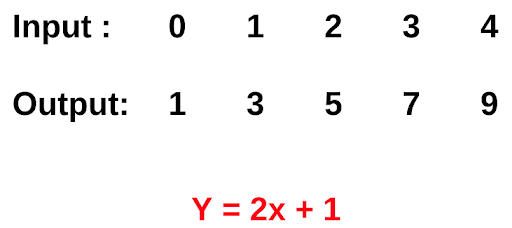

The answer to this is easy. We made a general rule on our own. But what if we are given to convert Celsius to Fahrenheit without using the formula. A machine learning solution that approximates the function that converts input to output.
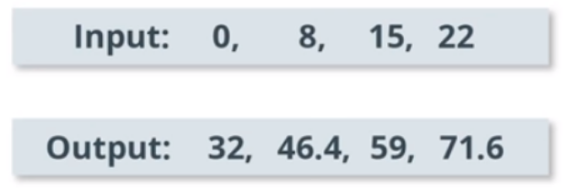
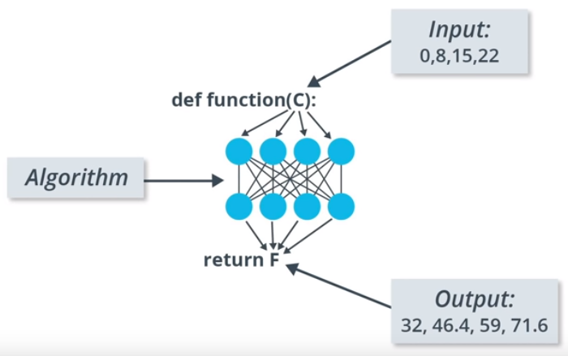

#### Supervised Learning
Supervised learning is a part of Machine Learning where for each example, we are given its features and the observed label.

During training, the model learns the different patterns in apples and cupcakes.  During prediction, based on the learned patterns, the model is able to tell whether it’s an apple or a cupcake. 

#### Unsupervised Learning
Unsupervised learning is a part of Machine Learning where for each example, we are given its features only and no observed (label) value is provided.
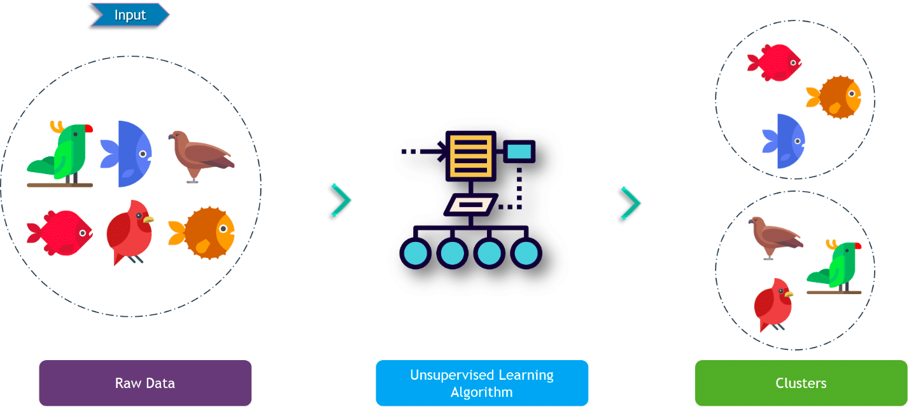
During training, the model captures the different patterns in the raw data.  Based on similarities in the data it forms clusters. During prediction, based on similarity (between input and the different clusters), it assigns the closest cluster to the input.

#### Supervised Learning vs Unsupervised Learning
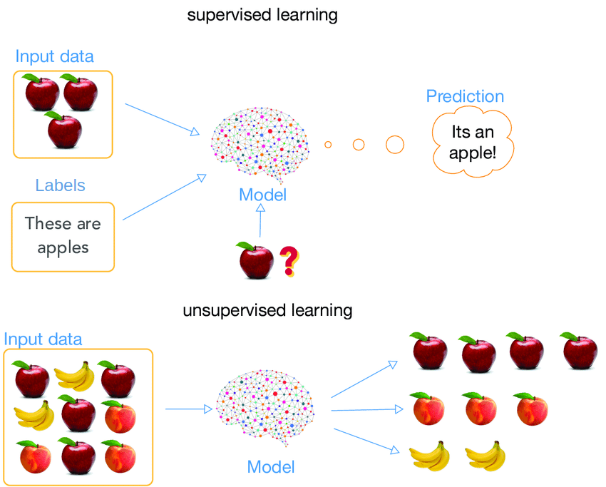

| Problem  | Solutions |
| ------------- | ------------- |
| Classification of spam vs not spam emails | supervised |
| Predicting house prices based on area, no. of rooms, location | supervised |
| Analyze bank data for weird-looking transactions, and flag those as fraud | unsupervised |
| Cluster Udacity students into types based on learning styles | unsupervised |

#### Regression
Regression accounts for the problems where the prediction value could be in the range of -∞ to +∞. Hence the prediction values can and will be a real number.

Linear regression performs the task to predict a dependent variable value (y) based on a given independent variable (x). So, this regression technique finds out a linear relationship between x (input) and y(output).

You want to predict house prices (dependent variable Y) based on ‘square feet’ (the independent variable X). You have a number of examples of house square feet and their corresponding prices. One solution is to find the best fit line. _But how do you define the best-fit line_? 

We can see from the diagram above that X and Y will follow a relation of $$Y = mX + c$$ which can also be mapped as $$Y = wX + b$$.

The best fit line will have the lowest error. How can we define error? 
We can define the error as the sum of the distance between each point and the line. Mathematically, this can be modelled for each data sample as abs(Y - Y_predicted).
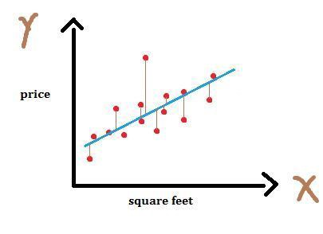

#### Classification
Classification, as the name suggests, is a problem were given an input we have to predict a class value which is

* Finite
* Predefined
* Differentiable from other classes

An example is, you are given a problem to identify from a given image, whether it’s an image of a dog or a cat. In this example the class values are finite. That is two in number. Predefined, the model cannot predict anything other than a cat or a dog. And both classes are different from each other.
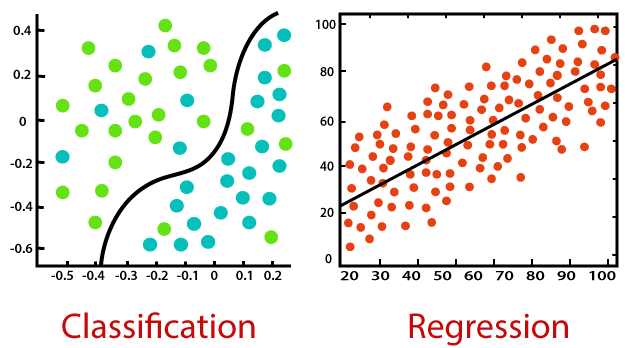

| Problem | Solution | Supervised ML ALgorithm |
| ------------- | ------------- | ------------- |
| Identify spam vs not spam emails | supervised | Classification |
| Predicting house prices based on area, no. of rooms, location | supervised | Regression |
| Identify from an image whether it’s an apple,  an orange or a pear | supervised | Classification |
| Predicting the number of bikes rented on a day based on weather | supervised | Regression |

#### Parametric vs Non-Parametric
We can classify a machine learning algorithm as either ‘parametric’ or ‘non-parametric’.
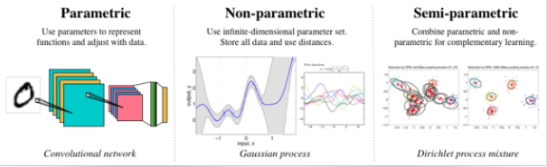

***Parametric Machine Learning***

In a parametric algorithm, the number of parameters is fixed with respect to the sample size. The number of parameters do not increase with the increase in data sample size. A parametric algorithm is hence computationally faster, but it makes stronger assumptions about the data; as a result, the model may perform well if the assumptions were correct, and perform poorly if the assumptions turn out to be incorrect. Linear Regression is an example of a parametric algorithm.

As we saw in the example of linear regression above, there were two parameters ‘w’ and ‘b’ and Y & X were following the relationship of $$Y = wX+b$$. Whether the number of data samples is 100 or 500, the relationship for linear regression between independent and dependent variables will remain the same and there will still be only two parameters. The number of parameters won’t change with the increase in data sample size. 

***Non-Parametric Machine Learning***

In contrast, a non-parametric algorithm uses a flexible number of parameters, and the number of (effective) parameters can grow with the sample size.  A non-parametric algorithm is computationally slower but it makes fewer assumptions about the data. K-nearest neighbour is a common example of a non-parametric algorithm.

### Bias and Variance

#### Bias

Bias is the error between predicted values and the correct value outputted by a model. 
High bias accounts for large error and a more simplified model which is under fitted. Low bias refers to smaller errors. High bias leads to a high error on training and test data.
Hence the inability for a machine learning model to capture the true relationship is called bias.

#### Variance

While the bias accounts for not being able to capture the relationship between training data and predictions, variance accounts for capturing only for the dataset it is being trained on. This is referred to as overfitting. 

Hence a machine learning model that only predicts well for a dataset on which it is trained on is a high variance model. Hence these models only work for training data sets and not test datasets.

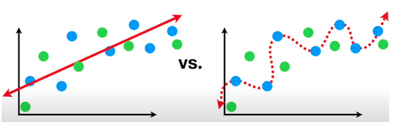

In this example, the blue dots are training dataset and green ones are test set. We can see that the left picture has high bias, but low variance. While the picture on the right has a low bias (0 bias) and high variance.

#### Bias and Variance in Parametric and Non-Parametric Models

Since we know that in Non-parametric models, the fit refers to the training data itself, hence the non-parametric models have very high variance.

But we know that parametric models have a few parameters that make a fit. This can lead to underfitting, high bias. These parametric models can also have high variance if we increase the number of parameters. But there are several techniques which can help reduce high variance in parametric models like bagging, boosting and regularization.

### Neural Networks

A neural network is a series of algorithms that endeavours to recognize underlying relationships in a set of data through a process that mimics the way the human brain operates.

A Neural network comprises of :

* Input units: The activity of the input units represents the raw information that is fed into the network. this also called input layer.
* Hidden units: The activity of each hidden unit is determined by the activities of the input units and the weights on the connections between the input and the hidden units. this also called the hidden layer.
* Output units: The behaviour of the output units depends on the activity of the hidden units and the weights between the hidden and output units. this also called output layer.

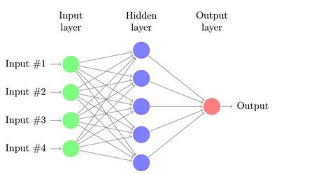

#### The basic unit

The basic unit of computation in a neural network is the neuron, often called as a node or unit. It receives input from some other nodes, or from an external source and computes an output. 

Simply put, it calculates a “weighted sum” of its input, adds a bias and then decides whether it should be “fired” or not. Activation Function is used to decide whether or not a node should be activated. 

A Deep Neural Network (DNN) has a similar structure, but it has two or more “hidden layers” of neurons that process inputs.

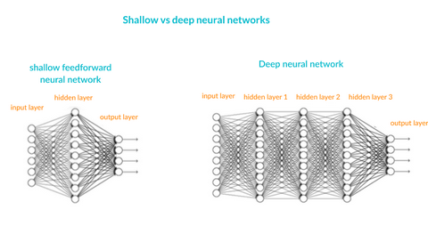

For a given input, different neurons are activated which collectively result in the predicted output for that input. The gif below helps to create an understanding of this concept. 

How basic neural network is trained follows on two important concepts:

* Gradient descent
* Backpropagation  

### Backpropagation

In machine learning, backpropagation is a widely used algorithm in training feedforward neural networks for supervised learning. Generalizations of backpropagation exist for other artificial neural networks (ANNs), and for functions generally – a class of algorithms referred to generically as "backpropagation". In fitting a neural network, backpropagation computes the gradient of the loss function with respect to the weights of the network for a single input-output example, and does so efficiently, unlike a naive direct computation of the gradient with respect to each weight individually.

### Gradient Descent

Gradient descent is an optimization algorithm used to minimize some function by iteratively moving in the direction of steepest descent as defined by the negative of the gradient. In machine learning, we use gradient descent to update the parameters of our model.

### Feature Engineering

In machine learning and pattern recognition, a feature is an individual measurable property or characteristic of a phenomenon being observed.

Feature engineering is the process of using domain knowledge of the data to create features that make machine learning algorithms work.

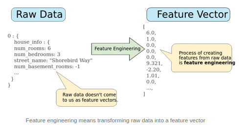

#### Mapping numeric values

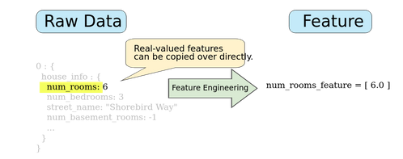

#### Mapping categorical values

Categorical features have a discrete set of possible values. For example, there might be a feature called street_name with options that include:

* Charleston Road
* North Shoreline Boulevard
* Shorebird Way
* Rengstorff Avenue

We can map each of these to an integer value and call this mapping a vocabulary.

| street_name | Integer Mapping |
| ------------- | ------------- |
| Charleston Road | 0 |
| North Shoreline Boulevard | 1 |
| Shorebird Way | 2 |
| Rengstorff Avenue | 3 |
| Others | OOV |

Since not every country will appear in our dataset, we can refer to other countries as OOV(out-of-vocabulary).

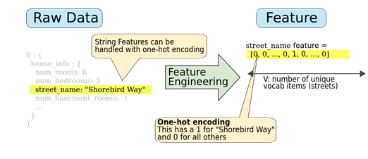

### Overfitting and underfitting: from memorization to generalization

#### Overfitting

*In statistics, overfitting is "the production of an analysis that
corresponds too closely or exactly to a particular set of data, and may,
therefore, fail to fit additional data or predict future observations
reliably"*

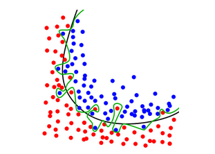

The green line represents an overfitted model and the black line
represents a regularized model. While the green line best follows the
training data, it is too dependent on that data and it is likely to have
a higher error rate on new unseen data, compared to the black line.

Hence, it is likely to have a higher error rate on the unseen data. On
the other hand, the black line is misclassifying a few training dataset
points, but it has picked up the general trend well and is more likely
to perform better on the unseen data. (source: Wikipedia)

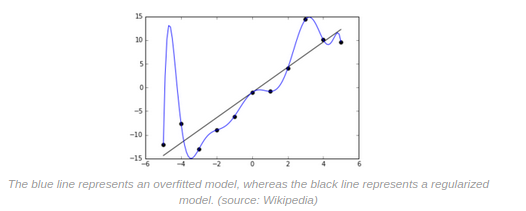

*The essence of overfitting is to have unknowingly extracted some of the
residual variation (i.e. the noise) as if that variation represented
underlying model structure.*

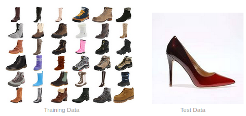

You train your model on the training set and you are classifying input
into 'shoe' and 'not shoe'. You are most likely to classify the test
data(high heels) as 'not shoe'. That is because you have overfitted in
your understanding of what a shoe looks like because your model's
training and experience in what shoes look like are hiking boots.

An overfitted model extracts features/trends from the dataset that do
not actually represent the generalization of the data structure. As a
result of this, when unseen data is unable to fit in the expected
structure, the model fails in predictions.

#### Underfitting

Another concept to understand is underfitting. Underfitting happens when
a machine learning model is not sufficiently complex to fully capture
the predictive power of the data on which it was trained. This can
happen for a number of reasons:

* model is not powerful enough
* model is over-regularized
* model has not been trained long enough(the network was unable to learn relevant patterns in the training data)

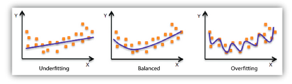

A simple straight line is a decent representation of the training data,
but it doesn't fully render the underlying curved relationship between
the variables x and y. Therefore, the model's outcomes will not be
accurate when you apply it to new data

#### From memorization to generalization

An overfitted model extracts features/trends from the dataset that do
not actually represent the generalization of the data structure. As a
result of this, when unseen data is unable to fit in the expected
structure, the model fails in predictions.

On the other hand, using under fitted models for decision-making could
be costly for businesses. For example, an under fitted model may suggest
that you can always make better sales by spending more on marketing when
in fact the model fails to capture a saturation effect (at some point,
sales will flatten out no matter how much more you spend on marketing).
([[Ref]](https://www.datarobot.com/wiki/underfitting/))

### Activation Function

We talked about a basic unit called neuron above. Each neuron takes a
weighted sum + bias of the input. The resultant value can range from
anything between -inf to +inf. Then how do you decide whether to
activate the neuron or not?

This is where Activation Functions are used. An activation function is
applied to the resultant value to decide whether or not to 'activate'
the particular neuron.

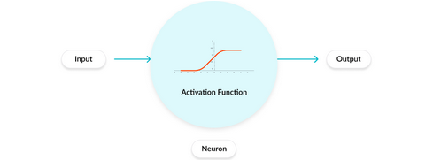

The purpose of the activation function is to introduce non-linearity
into the output of a neuron. This is important because most real-world
data is non-linear and we want neurons to learn these nonlinear
representations.

#### Types of Activation Functions:

##### Sigmoid 

It takes a real-valued input and squashes it to range between 0 and 1

σ(x) = 1 / (1 + exp(−x))

Ref: Wikipedia

If you notice, towards either end of the sigmoid function, the Y values
tend to respond very less to changes in X. What does that mean? The
gradient at that region is going to be small. It gives rise to a problem
of **vanishing gradients**. The gradient is small or has vanished. The
network refuses to learn further or is drastically slow, as it cannot
make significant changes in parameters as a result of the extremely
small changes in gradients.
[[Ref]](https://medium.com/the-theory-of-everything/understanding-activation-functions-in-neural-networks-9491262884e0)

##### TanH

Another activation function that is used is the tanh function.

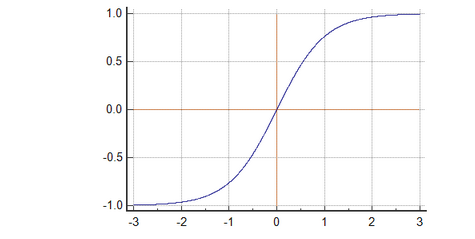

[[Ref]](https://www.medcalc.org/manual/tanh_function.php)

Tanh has a steeper gradient than sigmoid but like sigmoid, tanh also has
vanishing gradient problems.

##### Relu

ReLU stands for Rectified Linear Unit. It takes a real-valued input and
thresholds it at zero (replaces negative values with zero)

f(x) = max(0, x)

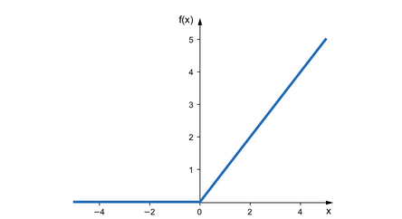

[[Ref]](https://www.google.com/url?sa=i&url=https%3A%2F%2Fsebastianraschka.com%2Ffaq%2Fdocs%2Frelu-derivative.html&psig=AOvVaw2bGFiAuTL82WOGVpduIpsl&ust=1591125596418000&source=images&cd=vfe&ved=0CAIQjRxqFwoTCIDZnvuq4ekCFQAAAAAdAAAAABAs)

Relu solves the vanishing gradient problem.

##### LeakyRelu

A Rectified Linear Unit (A unit employing the rectifier is also called a
rectified linear unit ReLU) has output 0 if the input is less than 0,
and raw output otherwise. That is, if the input is greater than 0, the
output is equal to the input. The operation of ReLU is closer to the way
our biological neurons work.

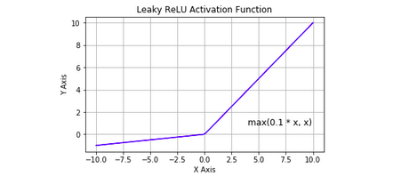

[[Ref]](https://www.google.com/url?sa=i&url=https%3A%2F%2Fwww.i2tutorials.com%2Fdeep-learning-interview-questions-and-answers%2Fexplain-step-threshold-and-leaky-relu-activation-functions%2F&psig=AOvVaw2bGFiAuTL82WOGVpduIpsl&ust=1591125596418000&source=images&cd=vfe&ved=0CAIQjRxqFwoTCIDZnvuq4ekCFQAAAAAdAAAAABAR)

### Automated Machine Learning (AutoML)

Automated machine learning (AutoML) is the process of automating the process of applying machine learning to real-world problems. AutoML covers the complete pipeline from the raw dataset to the deployable machine learning model. AutoML was proposed as an artificial intelligence-based solution to the ever-growing challenge of applying machine learning. The high degree of automation in AutoML allows non-experts to make use of machine learning models and techniques without requiring to become an expert in this field first.

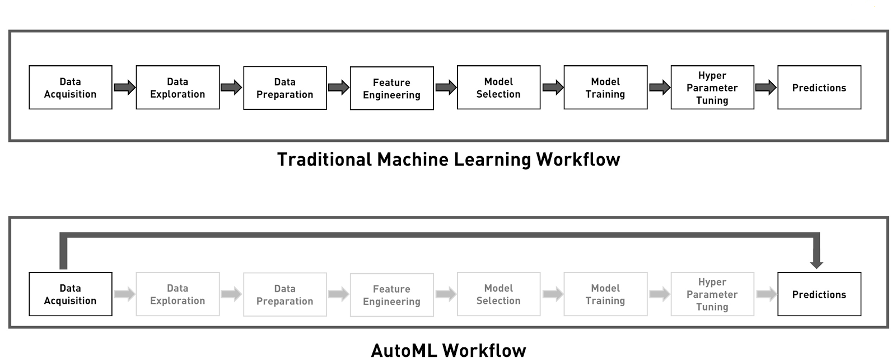

## TensorFlow 2

### What is TensorFlow?
TensorFlow is an end-to-end open-source platform for machine learning. It has a comprehensive, flexible ecosystem of tools, libraries and community resources that lets researchers push the state-of-the-art in ML and developers easily build and deploy ML-powered applications.

TensorFlow is a Machine Learning framework that allows the user to make an end to end machine learning pipeline. This includes data loading to data pre-processing, model building to training, visualization of training processes to the evaluation of models. And finally from these trained models to deploying them for a scalable prediction system either on-premises or on the cloud.

TensorFlow also provides a Lite version for mobile and IoT devices. And provides a wrapper for languages like Python, Swift and JavaScript.
* TensorFlow.js is a JavaScript library for training and deploying models in the browser and on Node.js.
* TensorFlow Lite is a lightweight library for deploying models on mobile and embedded devices.
* TensorFlow Extended is an end-to-end platform for preparing data, training, validating, and deploying models in large production environments.

Whether you’re an expert or a beginner, TensorFlow is an end-to-end platform that makes it easy for you to build and deploy ML models.

***Tensorboard***
TensorBoard is a brilliant tool that enables visualizing your ML models directly in your browser.

In machine learning, to improve something you often need to be able to measure it. TensorBoard is a tool for providing the measurements and visualizations needed during the machine learning workflow. It enables tracking experiment metrics like loss and accuracy, visualizing the model graph, projecting embeddings to a lower-dimensional space, and much more.

You can initialize and add TensorBoard as a callback in your code.
When training with Keras's Model.fit(), adding the tf.keras.callbacks.TensorBoard callback ensures that logs are created and stored.

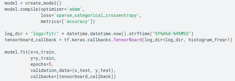

Start TensorBoard through the command line or within a notebook experience. The two interfaces are generally the same. In notebooks, use the %tensorboard line magic. On the command line, run the same command without "%".

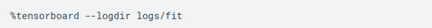

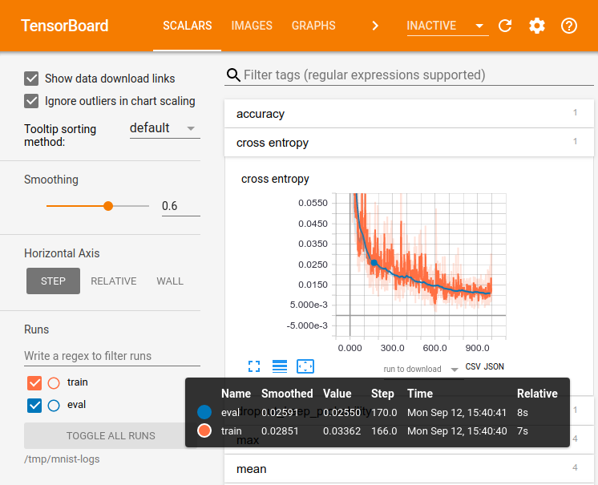

When training with other methods such as tf.GradientTape(), tf.summary is used to log the required information, for the TensorBoard to monitor training as it progresses. (Reference)

***TensorFlow Lite***
TensorFlow Lite is an open-source deep learning framework for on-device inference and can be used to deploy models on mobile and IoT devices. 

TensorFlow Lite consists of two main components:

* The TensorFlow Lite interpreter, which runs specially optimized models on many different hardware types, including mobile phones, embedded Linux devices, and microcontrollers.
* The TensorFlow Lite converter, which converts TensorFlow models into an efficient form for use by the interpreter, and can introduce optimizations to improve binary size and performance.

Performing machine learning on-device can help improve:

* Latency: there's no round-trip to a server
* Privacy: no data needs to leave the device
* Connectivity: an Internet connection isn't required
* Power consumption: network connections are power-hungry

#### Deployment Workflow

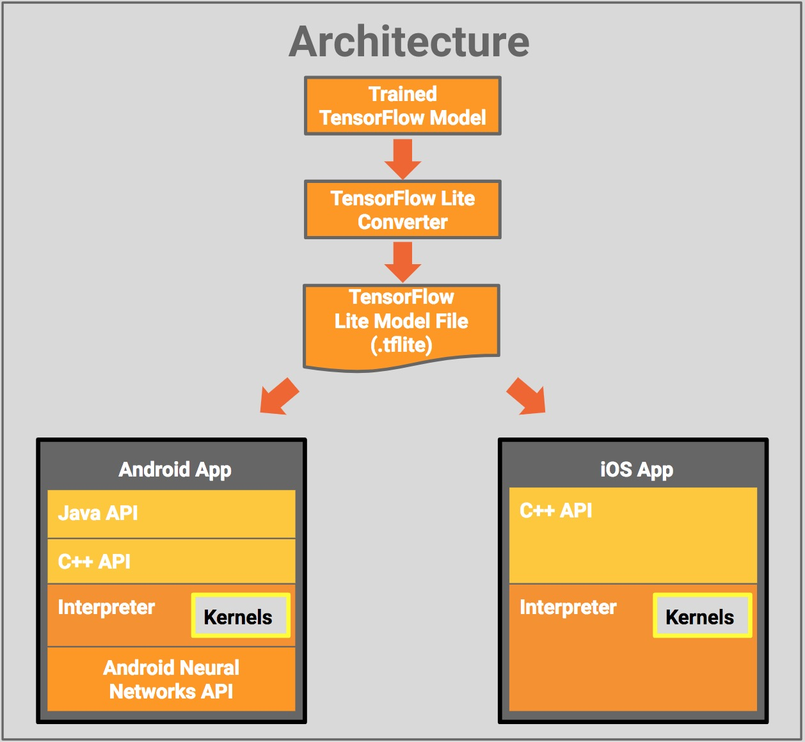

***TensorFlow JS***
TensorFlow.js is a library for machine learning in JavaScript. With TensorFlow.js you can develop ML models in JavaScript, and use ML directly in the browser or in Node.js

#### Deployment Workflow

* You can import an existing, pre-trained model for inference. If you have an existing TensorFlow or Keras model you’ve previously trained offline, you can convert into TensorFlow.js format, and load it into the browser for inference.
* You can re-train an imported model. As in the Pac-Man demo above, you can use transfer learning to augment an existing model trained offline using a small amount of data collected in the browser using a technique called Image Retraining. This is one way to train an accurate model quickly, using only a small amount of data.
* Author models directly in the browser. You can also use TensorFlow.js to define, train, and run models entirely in the browser using Javascript and a high-level layers API. If you’re familiar with Keras, the high-level layers API should feel familiar.

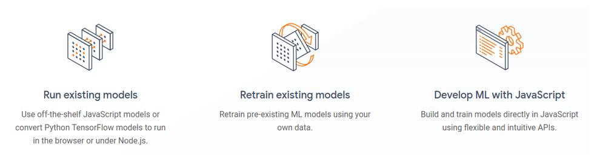

TensorFlow.js is powered by WebGL and provides a high-level layers API for defining models, and a low-level API for linear algebra and automatic differentiation. TensorFlow.js supports importing TensorFlow SavedModels and Keras models.

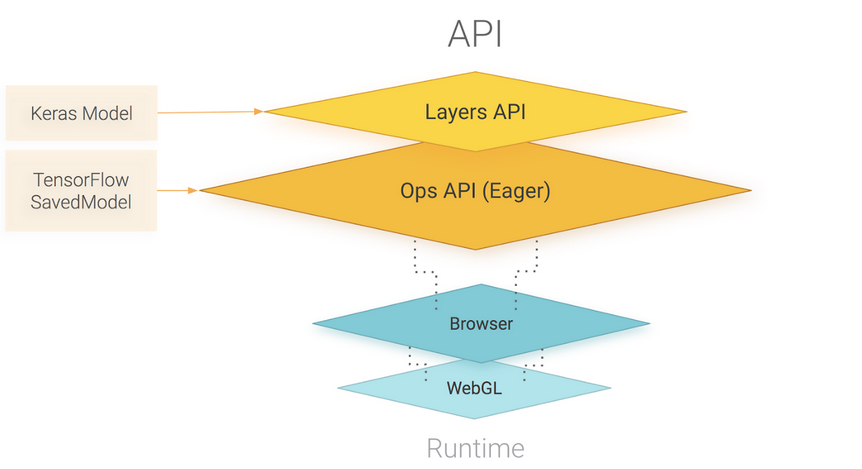

#### Easy model building
Build and train ML models easily using intuitive high-level APIs like Keras with eager execution, which helps for immediate model iteration and easy debugging.

#### Robust ML production anywhere
Easily train and deploy models in the cloud, on-prem, in the browser, or on-device no matter what language you use.

#### Powerful experimentation for research
A simple and flexible architecture to take new ideas from concept to code, to state-of-the-art models, and to publication faster.

### Keras

Keras or more popularly known as `tf.keras` in TensorFlow's high-level API for building and training deep learning models. It's used for fast prototyping, state-of-the-art research, and production, with three key advantages:
* User-friendly - Keras has a simple, consistent interface optimized for common use cases. It provides clear and actionable feedback for user errors.
* Modular and composable - Keras models are made by connecting configurable building blocks together, with few restrictions.
* Easy to extend - Write custom building blocks to express new ideas for research. Create new layers, metrics, loss functions, and develop state-of-the-art models

#### Sequential API
A Sequential model is appropriate for a plain stack of layers where each layer has exactly one input tensor and one output tensor.
A Sequential model is not appropriate when:

* Your model has multiple inputs or multiple outputs
* Any of your layers has multiple inputs or multiple outputs
* You need to do layer sharing
* You want non-linear topology (e.g. a residual connection, a multi-branch model)

#### Functional API
The Keras functional API provides a more flexible way for defining models.

It specifically allows you to define multiple input or output models as well as models that share layers. More than that, it allows you to define ad-hoc acyclic network graphs which are really useful when dealing with multi-modal inputs.

Models are defined by creating instances of layers and connecting them directly to each other in pairs, then defining a Model that specifies the layers to act as the input and output to the model.

### Components
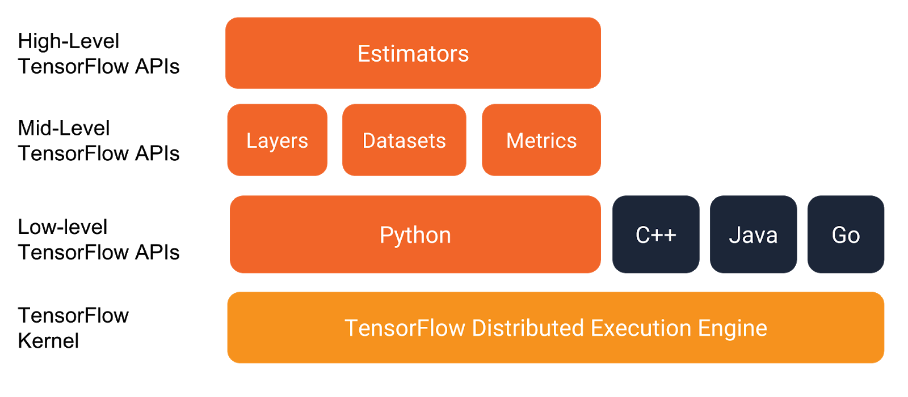

#### TensorFlow Datasets
TensorFlow Datasets is a collection of datasets ready to use, with TensorFlow or other Python ML frameworks, such as Jax. All datasets are exposed as tf.data.Datasets , enabling easy-to-use and high-performance input pipelines. We can see that it’s a mid level TensorFlow API.

#### TensorFlow Hub

TensorFlow Hub is a library for the publication, discovery, and consumption of reusable parts of machine learning models. A module is a self-contained piece of a TensorFlow graph, along with its weights and assets, that can be reused across different tasks in a process known as transfer learning. Transfer learning can help us:
* Training models with less data
* Improving generalization
* Speeding up training

#### Model Garden
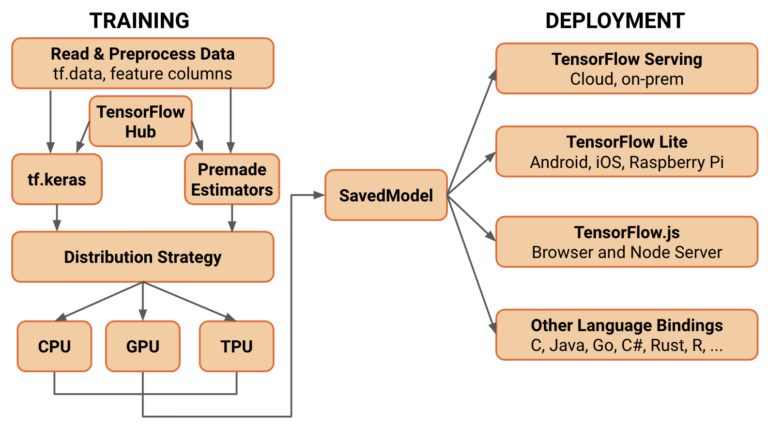
The Model Garden aims to demonstrate the best practices for modeling so that TensorFlow users can take full advantage of the recent TensorFlow 2 for their research and product development. TensorFlow Hub will keep playing its role as a repository where people can easily search for ready-to-use pre-trained models. We plan to increasingly make more state-of-the-art models from the Model Garden available in TensorFlow Hub, and TensorFlow Hub pages will link to the model implementations in the Model Garden.

### Use-cases
TensorFlow, because of its components and production built capabilities is widely used in both real world and research based solutions and products.
After TFLite and TFJs, these use cases have increased. 
Some of the most modern (and highly practical) research is being done in TensorFlow. Specifically in the areas like below
* Speech recognition
* Image recognition
* Object tagging videos
* Self-driving cars
* Sentiment analysis
* Text summarization
* Mobile image and video processing

Back to the [Index](../README.md)
