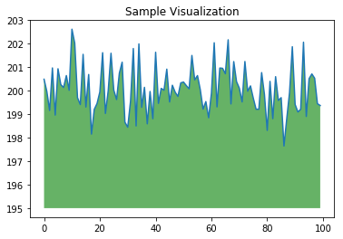
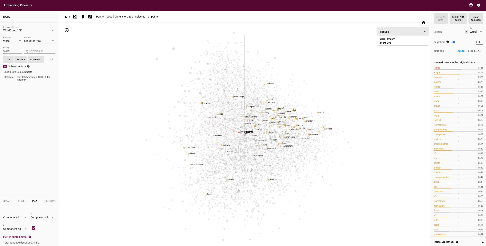
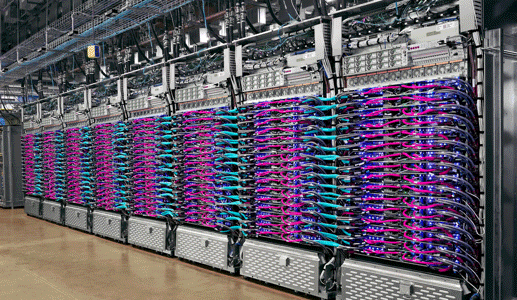

# Tooling

* [Colab](#Colab)
   * Colab for data science and deep learning
   * Using Colab with GitHub
   * Some things to consider while using Colab
   * Other notebook environments
* [Tensorflow Playground](#Tensorflow-Playground)
* [Tensorflow Projector](#Tensorflow-Projector)
* [What-If Tool](#What-If-Tool)
* [Teacheable Machine](#Teachable-Machine)
* [Kaggle](#Kaggle)
* [MNIST and Fashion MNIST datasets](#MNIST-and-Fashion-MNIST-datasets)
* [TPU](#TPU)
   * TPU types
   * Architecture
   * Edge TPU


## Colab

Colaboratory or Colab for short, allows to run and program Python in your browser, with no installations. Main features include:
* No configuration or setup required
* Free GPU and TPU access.
* Easy sharing of documents (notebooks), like if there were Google Docs or Sheets docs.
* Easy Github access.
* TensorFlow 2 already preinstalled.
* Targeted at students and research scientists. Colab is not targeted at enterprise production environments.

If you know the [Jupyter project](https://jupyter.org/), Colab is a **Jupyter notebook stored in Google Drive**. Using a Google account, you can create a new notebook just by going to [colab.research.google.com](colab.research.google.com). If you **_do not_** want the Colab Notebooks to get automatically saved in your Google Drive account, you can use Colab Scratchpads: https://colab.research.google.com/notebooks/empty.ipynb. 

Colab connects your notebook to a Cloud-based runtime, meaning you can execute Python without any setup. It also allows you to [connect to a local runtime](https://medium.com/@jasonrichards911/getting-local-with-google-colab-a4d69f373364) but in this post, we will mainly be focusing on the former one i.e. the Cloud-based online runtime. 

A notebook document is composed of cells, of two types: code and text cells. **Code cells** contain python code. **Text cells** allow to add headings, paragraph, images, lists, even mathematical formulas using Markdown. All cells are executed using CMD+ENTER.

Notebooks used in Colab follow .ipynb standard format, and can be shared using Google Drive, github or can download it to be used in other compatible frameworks, like Jupyter notebooks, Jupyterlab. Moreover, you can find Notebooks repositories aroudn internet, like the [TensorFlow Hub project](https://tfhub.dev/), where there are many notebooks available and can be directly open in Colab.

### Colab for data science and deep learning

Colab comes with **TensorFlow 2 preinstalled**. But you can use any other dee learnihng framework with python. Note however Colab does not support R or scala. Additionally, Colab can use and import any popular library to visualize data. For example, you can import `numpy` to generate data and visualize it using `matplotlib`.

```python
import numpy as np
from matplotlib import pyplot as plt

ys = 200 + np.random.randn(100)
x = [x for x in range(len(ys))]

plt.plot(x, ys, '-')
plt.fill_between(x, ys, 195, where=(ys > 195), facecolor='g', alpha=0.6)

plt.title("Sample Visualization")
plt.show()
```


|  | 
|:--:| 
| *Figure: Using numpy and matplotlib with Colab* |


### Using Colab with GitHub

Opening and saving `.ipynb` files stored on GitHub with Colab is easy: just add your GitHub path to colab.research.google.com/github/. For example, [colab.research.google.com/github/tensorflow/tensor2tensor/blob/master/tensor2tensor/notebooks/hello_t2t.ipynb](colab.research.google.com/github/tensorflow/tensor2tensor/blob/master/tensor2tensor/notebooks/hello_t2t.ipynb) will directly load this `.ipynb` stored on GitHub. For convenience, you can also use the [Open in Colab](https://chrome.google.com/webstore/detail/open-in-colab/iogfkhleblhcpcekbiedikdehleodpjo?hl=en) Chrome extension

You can also easily save a copy of your Colab notebook to Github by using File > Save a copy to GitHub.

### Some things to consider while using Colab

- Don't use an accelerator like a GPU or a TPU until it is required. It prevents abuse of use. 
- After your work is done, always terminate the session that frees up the resources allocated. This will also help you to reduce the number of cool-downs. 

### Other notebook environments

* **CAIP notebooks** (or Google Cloud AI Platforms notebooks): is a Google Cloud platform product, a managed service for JupyterLab, enterprise-grade, built on top of DL VM images. It is executed in user projects, and is now part of AI Platform. 

* **Colaboratory Pro** (or Colab Pro): similar to Colab, is a Google Brain product, not part of Google Cloud. [Announced in February 2020](https://colab.research.google.com/notebooks/pro.ipynb), it's a paid-based product (USD 9.99 / month), which provides faster GPUs(T4, P100), high-memory VMs and longer runtimes (before runtimes were resetted every 12 hours). 

* **Kaggle Kernels**: Similar to what Colab already offers but [Kaggle Kernels](https://www.kaggle.com/kernels) make it easier to work with Kaggle datasets. 

## TensorFlow playground

[TensorFlow playground](https://playground.tensorflow.org/) is an interactive visualization of neural networks, written in TypeScript using d3.js. The open-source project, called **deep playground** is available in Github, and open for contributions.

TensorFlow playground allows to change the following **model hyperparmeters**, directly in the user interface:
* Learning rate: between 0.00001 and 10
* Activation: tanh, sigmoid, ReLU or linear.
* Regularization: L1, L2 or None.
* Regularization rate: between 0 to 10
* Problem type: regression or classification
* Numer of hidden layers

|  | 
|:--:| 
| *Figure: TensorFlow playground* |

## TensorFlow projector

[TensorFlow projector](https://projector.tensorflow.org/) is an interactive visualization tool  of high dimensional embeddings. An embedding is a mathematical vector that captures different dimensions of the data (words, videos or soudns). TensorFlow projector allows to visualize and understand an embedding layer.

For example: this tool allows you to search for specific words (`leagues` in the figure below), and will highlight words that are close in the embedding space. You can navigate thorugh views of the data, zoom or rotate to get the insights.

|  | 
|:--:| 
| *Figure: TensorFlow projector* |

## What-If Tool

[What-If Tool](https://pair-code.github.io/what-if-tool/) is a tool created by Google Brain, that makes visualization of your data within a notebook, and allows you to udnerstand the output of your models. It supported any python framework, not only TensorFlow.

Explainable AI (XAI) is a set of techniques of artificial intelligence that allow humans to understand the output of models, in contrast with the black box concept. One method of implementing XAI is using input attribution, which provides a score proportional to the feature's contribution to the model's prediction. For example, if a model output of a bank denies a mortgage to a customer, XAI will tell which feature (account balance, age, finantial status, ...) contributed most to the model's prediction. The What-If Tool does not generate attributions, however, you can use the What-if Tool with any feature attribution mechanism, including LIME, SHAP, integrated gradients and others.

What-If tool is integrated with Cloud AI Platform and Explainability (see [here](https://cloud.google.com/blog/products/ai-machine-learning/introducing-the-what-if-tool-for-cloud-ai-platform-models)), thus you can make a call to What-If tool directly from your notebook.

|  | 
|:--:| 
| *Figure: What-If tool (source: What-If Tool page)* |


## Teachable machine

[Teachable Machine](https://teachablemachine.withgoogle.com/) is a web-based tool that makes creating machine learning models fast, easy, and accessible to everyone.

You can make deep learning training with any of the following input types:
* **Images**, pulled from your webcam or image files.
* **Sounds**, in one-second snippets from your mic.
* **Poses**, where the computer guesses the position of your arms, legs, etc from an image.

Teachable Machine uses Tensorflow.js, a library for machine learning in Javascript, to train and run the models you make in your web browser.

After training, you can save your project entirely to Google Drive, in a .zip file that contains all the samples in each of your classes to Drive. Or you can download your model to use it externally.

|  | 
|:--:| 
| *Figure: Teachable machine* |

## Kaggle

[Kaggle](https://www.kaggle.com/), subsidiary of Google, is an online community of data scientists and machine learning practitioners.   
Kaggle allows users to find and publish data sets, explore and build models in a web-based data-science environment, work with other data scientists and machine learning engineers, and enter competitions to solve data science challenges.  
Kaggle got its start in 2010 by offering machine learning competitions and now also offers a public data platform, a cloud-based workbench for data science, and Artificial Intelligence education. 

## MNIST and Fashion MNIST datasets

**MNIST database** (Modified National Institute of Standards and Technology database) is a database of handwritten digits (10 classes), used as a "Hello World" of image processing systems. it is a subset of a larger NIST database, created by Yann LeCun, Corinna Cortes,  and Christopher J.C. Burges. Contains grayscale images of 28x28 pixels, with 60,000 examples for training and 10,000 examples for testing.

More information and download [here](http://yann.lecun.com/exdb/mnist/).

**Fashion-MNIST database** is a dataset by Zalando, containing images of articles, with 10 classes and 60,000 examples for training and 10,000 examples for testing. Each example is a 28x28 grayscale image, associated with a label from 10 classes. Fashion MNIST tries to be a replacement of rthe original MNIST. 

More information and is available [here](https://github.com/zalandoresearch/fashion-mnist). 

## Introduction to TPU

The Tensor Processing Unit (TPU) is a custom ASIC chip, designed by Google, **mainly designed for training** neural networks, although can also do inference.
It's currently in production in several Google consumer products, like email, YouTube and others. It's also available in Google Cloud Platform and some research products like [Colab](#Colab).
It can be used not only by TensorFlow, but also by other deep learning frameworks like [PyTorch](https://cloud.google.com/tpu/docs/tutorials/pytorch-pod).

But what's the difference between a CPU, a GPU and a TPU ? You can access to this [demo site](https://storage.googleapis.com/nexttpu/index.html) or to [this link](https://cloud.google.com/blog/products/ai-machine-learning) to know more, but here is a quick summary:
* **CPU is a general purpose processor**, very flexible, that can be used for many tasks (word processing, bank transactions, ...) but lacks of parallelism and is slow for deep learning because needs to access the memory every time a single calculation is done by the Arithmetic Logic Units (ALU, the CPU component that holds and controls multipliers and adders).
* **GPU is also a general purpose processor but able to perform massive parallelism**, such as matrix multiplications in a neural network, making suitable for deep learning. But still a GPU is a general purpose processor and has the same problem as before: a GPU needs a access shared memory to read and store intermediate calculations, which has also implications in energy consumption accessing memory.
* **TPU is a matrix processor specialized for matrix multiplications**, so is not a general purpose processor. It uses a systolic array architecture, based on thousands of multipliers and adders and connect them to each other directly to form a large physical matrix. The TPU loads first the paramters from memory, then the data, and finally executes the matrix multiplication, performing addings and data passing. During the whole process of massive calculations and data passing, **no memory access** is required at all. This is why the TPU can achieve a high computational throughput on neural network calculations with **much less power consumption**.

Note TPUs are not suited for all type of deep learning models. For example: if your model is dominated by element-wise multiplication (different from matrix multiplication, which is the recommended for TPUs); workloads that require double-precission arithmetic, or custom TensorFlow operations written in C++ (for this, better use CPUs). More information can be found [here](https://cloud.google.com/tpu/docs/tpus?hl=en#when_to_use_tpus).


### TPU types

There are different TPU devices depending on their capability:
* **Single device TPU types**, which are independent TPU devices without direct network connections to other TPU devices in a Google data center. For example: TPU v2-8 and TPU v3-8, each one containing 8 TPU cores.
* **TPU pods**, which are clusters of TPU devices that are connected to each other over dedicated high-speed networks, i.e., more efficient than connecting several independent TPU together in a single VM. For example: TPU v2-32 to 512 where number (32 to 512) refers to number of cores in the pod, or TPU v3-32 to 2048 (up to 2048 TPUs! in the pod).


|  | 
|:--:| 
| *Figure: Cloud TPU Pod v3. Source: cloud.google.com/tpu* |

Here is a table describing TPU v2-8 and TPU v3-8:

**TPU v2-8** | **TPU v3-8**
----------------- | ------------------
8 GiB of HBM for each TPU core | 16 GiB of HBM for each TPU core
One MXU for each TPU core | Two MXU for each TPU core
Up to 512 total TPU cores and 4 TiB of total memory in a TPU Pod | Up to 2048 total TPU cores and 32 TiB of total memory in a TPU Pod
45 Tflops/chip | 105 Tflops/chip
Available for free in Colab [6] | Pay-per-use in Google Cloud Platform


For comparison purposes nVidia P100 has 18 Tflops, while NVidia V100 has 112 Tflops.

Note TPU v2-8 **can be used for free** in Colab, while the rest can be used from Google Cloud Platform services, like Compute Engine, Kubernetes Engine, Dataproc or CAIP notebooks. Note TPU pods are only available with a 1 year or 3 year commitment.


### Architecture 

The TPU architecture is based on a systolic array, that contains  256 × 256 = total 65,536 ALUs to perform matrix multiplication operations of inputs and weights in parallel:

|  | 
|:--:| 
| *Figure: Systolic array architecture. Source: Google blog* |


Each TPU chip has two cores. Each TPU core has a HBM memory module, and also a scalar, vector, and matrix (MXU) units. The MXU is probably the most important part, and is capable of performing 16K multiply-accumulate operations in each cycle. 

While the MXU inputs and outputs are 32-bit floating point values, the MXU performs multiplies at reduced [bfloat16 precision](https://github.com/tensorflow/tensorflow/blob/master/tensorflow/core/framework/bfloat16.h). Bfloat16 is a 16-bit floating point representation that provides better training and model accuracy than the IEEE half-precision representation. Bfloat16 provides the same range as float32 (i.e. initial and end number is the same) but reduces the precission (some gaps between initial and end number). The advantage is that  machine learning apps care less about the precission, while using bfloat16 reduces complexitiy and memory needed by half.

### Edge TPU

The Coral Edge TPU is an inference accelerator, targeting at making inference at devices and IoT applications. It's optimized for vision applications and convolutional neural networks. It follows the same architecture as a Cloud TPU, but requires quantized TensorFlow Lite models.
More information can be found at [Coral web page](https://coral.ai/products/)

Back to the [Index](../README.md)
