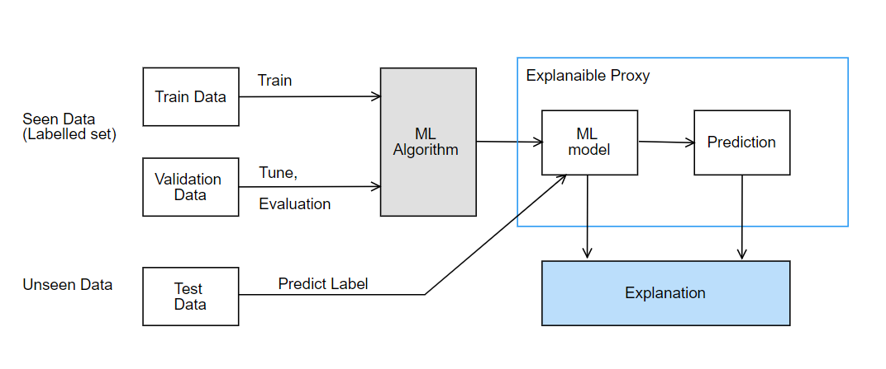
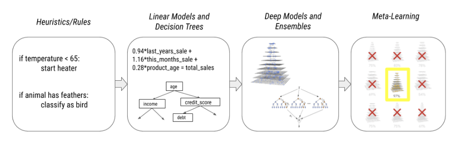
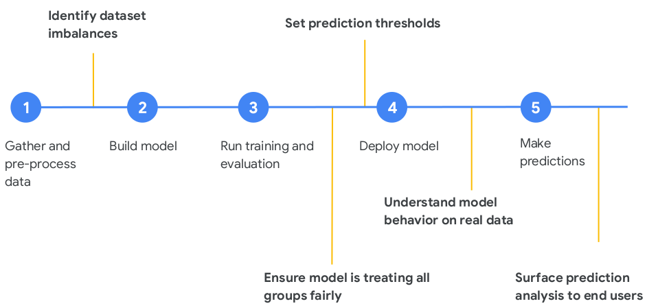

# Advanced topics
  * The importance of quality data: where the bias comes from
  * ML explainability: why this is hard
  * Why developers need to understand AI principles: https://ai.google/principles/
  * TFData
  * Pipelines


Back to the [Index](../README.md)


# The importance of quality data: where the bias comes from

# ML Explainability



As the compute resources and dataset sizes have increased overtime, more complex non-near models have been developed. We have seen a shift from the traditional rule based/heuristics to linear models, decision trees, followed by deep models and ensembles to even the concept of meta-learning where models are created by other models.



Although this advancement has brought a paradigm shift along multiple dimensions allowing models to have more:
- Expressiveness
- Versatility
- Adaptability
- Efficiency

On the flip side, more complex models become increasingly opaque. This is where model explainability becomes increasingly relevant. Model explainability is one of the most important problems in machine learning today. It’s often the case that certain “black box” models such as deep neural networks are deployed to production and are running critical systems. Understanding model behaviour is important to both model builders and model end users. 
Some of the simple definitions for ML explainability are as follows:
- Ability to explain or to present in understandable terms to a human
- The process of understanding how and why a machine learning model is making predictions

### Common methods used for ML explainability:
- Sampled Shapely
- Integrated gradients
- XRAI
- DeepLift

### ML explainability helps to:
- Identify feature importance
- Understand model behaviour
- Give insights into e.g
  * Why did the model predict a cat instead of a dog?
  * Why did a transaction get flagged as fraudulent instead of non-fraudulent?
  * Which parts of an image gave the highest signals for model prediction?
  * Which words in the sentence gave the highest signals for model prediction?
       
### How ML explainability fits into the ML lifecycle:



# Why developers need to understand AI principles

AI and other advanced technologies have incredible potential to empower people, widely benefit current and future generations, and work for the common good. But these same technologies also raise important challenges that we need to address clearly, thoughtfully, and affirmatively. Ai principles set out commitment to develop technology responsibly and establish specific application areas which should not be pursued.

## AI Principles by Google 

[[AI Principles by Google]](https://ai.google/principles/) is a concrete example of how a company might foster ethical principles. These principles set out Google's commitment to develop technology responsibly and establish specific application areas the company will not pursue. According these principles, Google will assess AI applications in view of the following objectives:


**Be socially beneficial**

The expanded reach of new technologies increasingly touches society as a whole. Advances in AI will have transformative impacts in a wide range of fields, including healthcare, security, energy, transportation, manufacturing, and entertainment. As we consider potential development and uses of AI technologies, we will take into account a broad range of social and economic factors, and will proceed where we believe that the overall likely benefits substantially exceed the foreseeable risks and downsides.


**Avoid creating or reinforcing unfair bias**

AI algorithms and datasets can reflect, reinforce, or reduce unfair biases. We recognize that distinguishing fair from unfair biases is not always simple, and differs across cultures and societies. We will seek to avoid unjust impacts on people, particularly those related to sensitive characteristics such as race, ethnicity, gender, nationality, income, sexual orientation, ability, and political or religious belief.


**Be built and tested for safety**

We will continue to develop and apply strong safety and security practices to avoid unintended results that create risks of harm. We will design our AI systems to be appropriately cautious, and seek to develop them in accordance with best practices in AI safety research. In appropriate cases, we will test AI technologies in constrained environments and monitor their operation after deployment.


**Be accountable to people**

We will design AI systems that provide appropriate opportunities for feedback, relevant explanations, and appeal. Our AI technologies will be subject to appropriate human direction and control.


**Incorporate privacy design principles**

We will incorporate our privacy principles in the development and use of our AI technologies. We will give opportunity for notice and consent, encourage architectures with privacy safeguards, and provide appropriate transparency and control over the use of data.


**Uphold high standards of scientific excellence**

Technological innovation is rooted in the scientific method and a commitment to open inquiry, intellectual rigor, integrity, and collaboration. AI tools have the potential to unlock new realms of scientific research and knowledge in critical domains like biology, chemistry, medicine, and environmental sciences. We aspire to high standards of scientific excellence as we work to progress AI development.

**Be made available for uses that accord with these principle**

Many technologies have multiple uses. We will work to limit potentially harmful or abusive applications. As we develop and deploy AI technologies, we will evaluate likely uses in light of the following factors:

  * Primary purpose and use: the primary purpose and likely use of a technology and application, including how closely the solution is related to or adaptable to a harmful use
  * Nature and uniqueness: whether we are making available technology that is unique or more generally available
  * Scale: whether the use of this technology will have significant impact
  * Nature of Google’s involvement: whether we are providing general-purpose tools, integrating tools for customers, or developing custom solutions

# tf.data

`tf.data` is a TensorFlow class that allows to build complex data pipelines from simple elements stored for example in disk or memory. It is able to handle large amounts of data,r ead from different data formats and perform complex transformations.

`tf.data.Dataset` is an abstraction that includes a sequence of elements, where each element can contain multiple information. For example, in the case of images, an element contains the image as well as the label.

There are two ways to create a `tf.data.Dataset`:

* **Directly from the source**, for example from memory or files. In the case of creating the dataset from memory, you can use `tf.data.Datasets.from_tensor_slices`, which creates a `tf.data.Dataset` whose elements are slices of the given tensors:
```python
# Slicing a 2D tensor produces 1D tensor elements.
dataset = tf.data.Dataset.from_tensor_slices([[1, 2], [3, 4]])
list(dataset.as_numpy_iterator())
```

* **From a transformation**. Once you have a Dataset object, you can transform it into a new Dataset by chaining method calls on the `tf.data.Dataset object`. For example, you can apply per-element transformations with `tf.data.Datasets.map` (or multi-element transformations such as `tf.data.Dataset.batch`):

```python
dataset = Dataset.range(1, 6)  # [ 1, 2, 3, 4, 5 ]
dataset = dataset.map(lambda x: x + 1)  # [ 2, 3, 4, 5, 6 ]
```

More information on `tf.data.Datasets.map` can be found [here](https://www.tensorflow.org/api_docs/python/tf/data/Dataset?version=nightly#map
)


You can read **numpy arrays** very easily with `tf.data.Dataset`. Assuming you have the an array of images and their labels, you can just use
`tf.data.Dataset.from_tensor_slices` to create a `tf.data.Dataset` from numpy arrays:
```python
train_dataset = tf.data.Dataset.from_tensor_slices((train_examples, train_labels))
test_dataset = tf.data.Dataset.from_tensor_slices((test_examples, test_labels))
```

`tf.data.Dataset` also supports functions to shuffle and batch the data:
```python
BATCH_SIZE = 64
SHUFFLE_BUFFER_SIZE = 100

train_dataset = train_dataset.shuffle(SHUFFLE_BUFFER_SIZE).batch(BATCH_SIZE)
test_dataset = test_dataset.batch(BATCH_SIZE)
```


Another way if you want to use numpy arrays instead of `tf.data.Datasets` or `tf.Tensors` is by passing the return value to `tfds.as_numpy`. 

```python
cats_vs_dogs = tfds.builder('cats_vs_dogs')

(raw_train, raw_test), metadata = tfds.load(
    'cats_vs_dogs',
    split=['train[:90%]', 'train[90%:]'],
    with_info=True)

# And convert the Dataset to NumPy arrays if you'd like
for example in tfds.as_numpy(raw_train):
  image = example['image']
```

# MLOps and Pipelines

MLOps is the practice of applying DevOps practices to help automate, manage, and audit machine learning (ML) workflows. ML workflows include steps to:

* Prepare, analyze, and transform data.
* Train and evaluate a model.
* Deploy trained models to production.
* Track ML artifacts and understand their dependencies.

TFX makes it easier to implement MLOps by providing a toolkit that helps you orchestrate your ML process on various orchestrators, such as: Apache Airflow, Apache Beam, and Kubeflow Pipelines. TensorFlow Extended (TFX) is an end-to-end platform for deploying production ML pipelines, and provides the following:

* **TFX pipelines:** a pipeline is a portable implementation of an ML workflow. TFX pipelines is a toolkit for building ML pipelines. 

* **TFX components:** components that you can use as a part of a pipeline.

* **TFX libraries:** base functionality for many of the standard components.


## TFX pipelines

A TFX pipeline can run on various orchestrators, such as: Apache Airflow, Apache Beam, and Kubeflow Pipelines. A **pipeline** is composed of component instances and input parameters.

Component instances produce artifacts as outputs and typically depend on artifacts produced by upstream component instances as inputs. 

## TFX standard components

A TFX pipeline is a **sequence of components** that implement an ML pipeline which is specifically designed for scalable, high-performance machine learning tasks. That includes modeling, training, serving inference, and managing deployments to online, native mobile, and JavaScript targets.

## TFX libraries

Libraries which provide the base functionality for many of the standard components. You can use the **TFX libraries** to add this functionality to your own custom components, or use them separately. Libraries include:

* **TensorFlow Data Validation (TFDV)** is a library for analyzing and validating machine learning data. It is designed to be highly scalable and to work well with TensorFlow and TFX.

* **TensorFlow Transform (TFT)** is a library for preprocessing data with TensorFlow.

* **TensorFlow Model Analysis (TFMA)** is a library for evaluating TensorFlow models. It is used along with TensorFlow to create an EvalSavedModel, which becomes the basis for its analysis. It allows users to evaluate their models on large amounts of data in a distributed manner, using the same metrics defined in their trainer. 

* **TensorFlow Metadata (TFMD)** provides standard representations for metadata that are useful when training machine learning models with TensorFlow. The metadata may be produced by hand or automatically during input data analysis, and may be consumed for data validation, exploration, and transformation. 

* **ML Metadata (MLMD)** is a library for recording and retrieving metadata associated with ML developer and data scientist workflows. Most often the metadata uses TFMD representations. MLMD manages persistence using SQL-Lite, MySQL, and other similar data stores.

* **TensorFlow Serving** is a flexible, high-performance serving system for machine learning models, designed for production environments. TensorFlow Serving makes it easy to deploy new algorithms and experiments, while keeping the same server architecture and APIs.

