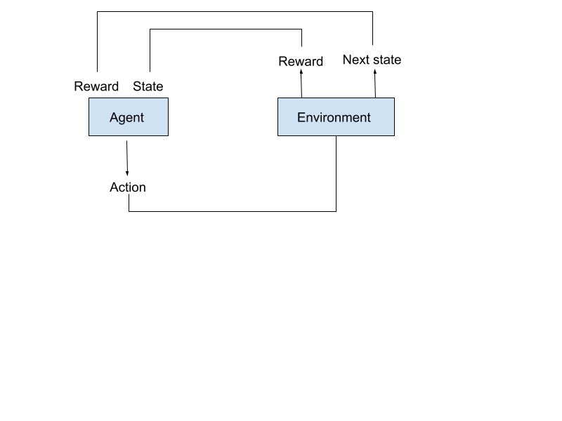
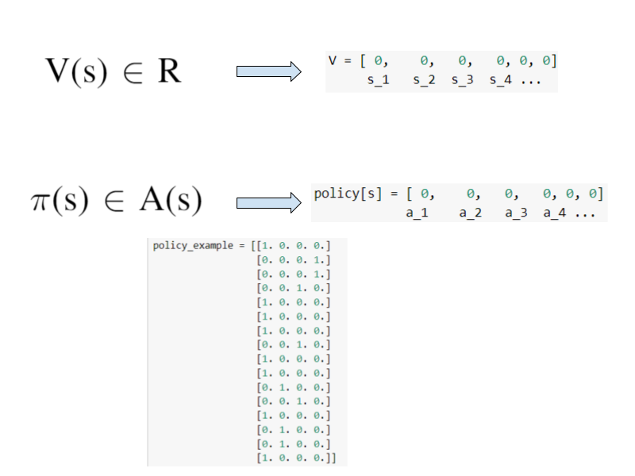
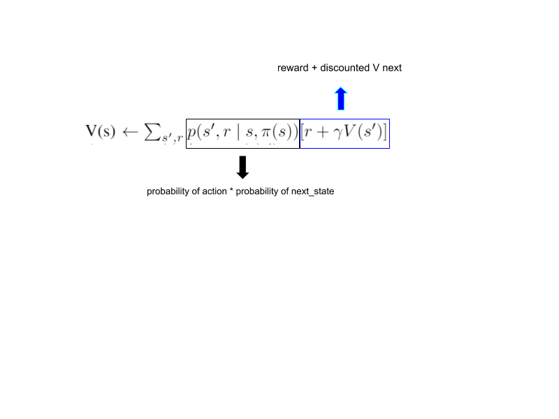
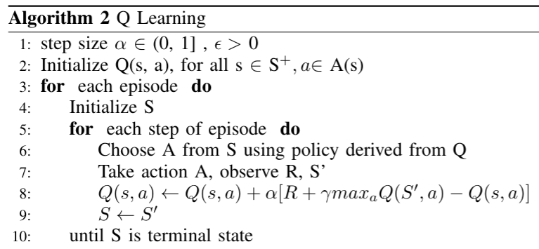
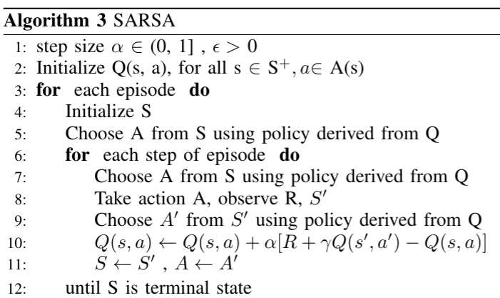

# Next Steps
  * Guide to the next step learning
    * Classify properly the next steps: one section per item, not just at the end.
  * Further topics
    * Auto ML
    * Cloud ML APIs
    * ML BigQuery

Back to the [Index](../README.md)

# Next Steps

* [Introduction to Reinforcement Learning](#Introduction-to-Reinforcement-Learning)
* [Markov Decision Processes](#Markov-Decision-Processes)
* [Dynamic Programming](#Dynamic-Programming)
* [Q Learning/SARSA](#Q-Learning/SARSA)
* [Deep Reinforcement Learning](#Deep-Reinforcement-Learning)

## Introduction to Reinforcement Learning
Supervised and Unsupervised Learning are learning methods applied over labeled or unlabeled data. In contrast, Reinforced Learning is a form of learning where there is no data. The agent has to interact with the environment to collect data. This definition has been made for beginners in this field and there are exceptions. 

In its shortest definition, it is described as follows in the book Reinforcement Learning: An Introduction;  Reinforcement learning problems involve learning what to do—how to map situations to actions—so as to maximize a numerical reward signal. Briefly, if we think about human life; reinforcement learning is the problem of trying to choose the best actions with taking into account the reward signal that comes to us in a situation in which we are placed. 

As an example, let's say that you are in an empty room and nothing is said(there is no prior knowledge) to you. And there is one glass in this room. The Reinforcement Learning problem is what you should do now. Let's say you took the glass in your hand and accidentally dropped it while looking at it, and suddenly you were given a negative reward, that is, punished. You don't want to drop the glass again because you got a negative reward, right? So you try not to drop the glass. Then let's imagine that you turned the glass by chance while dealing with the glass. And let's imagine that you got a positive reward thanks to this action. For a simple RL problem, you can now understand that your task is to turn the glass without dropping and you can do the best actions to maximize the rewards. In this example, there are many problems that reinforcement learning is already dealing with, but you should examine these issues in more detail.

Let's look briefly at the terms and meanings that we will use in RL:
* Agent is defined as the program that interacts with the environment.
* Environment is the program in which the agent can act and in return provides some feedback.
* The Reward is a numerical signal coming from the environment to the agent according to the actions of the agent. On each time step, the environment sends to the agent a reward. The agent’s objective is to maximize the total reward it receives over the long run.
* Policy basically defines the agent’s actions at a given time and state. 
* The model of the environment is something that mimics the behavior of the environment or more generally allows inferences about how the environment will behave with given information.

## Markov Decision Processes

Before solving Reinforcement Learning problems, we want to define these problems in mathematically idealized forms for making precise theoretical statements.

|  | 
|:--:| 
| *Figure: Markov Decision Processes* |

A Markov Decision Process (MDP) model contains: 
* Set of world states S 
* Set of actions A 
* Reward function R(s,a) 
* Transition Probabilities Pr → For each state and action the probability distribution over next states. İf every state and action pair include 1 value for at least one next state, it will be a deterministic environment.

Markov Property: the effects of an action taken in a state depend only on that state.

Let's now briefly explain this process:

MDP is a process where the agent and the environment interact with each other. First, the environment provides an initial condition(state t_0) for the agent, where the agent can take the first action. After the agent takes the first action in the environment, the next state(s_t_1) and reward signal are provided from the environment to the agent. The agent takes this new state as its state and takes action again, and this process continues until the terminal state.

## Dynamic Programming

|  | 
|:--:| 
| *Figure: Policy Iteration* |

Dynamic Programming tries to find the optimal policy in an environment defined with a MDP. MDP models must have transition possibilities in order to use dynamic programming.

Let's briefly explain and interpret the dynamic programming process that we see in the figure without going into too much technical details:
|  | 
|:--:| 
| *Figure: Policy Iteration Explained* |

In the first process, we create our V(s) function with an initial value for each state. We can think of the V function as a table for this case(for DP). So V(s) is a table containing the value of every state. After V(s), policy Pi is next. Pi(s) is a function like V(s). And for this case, Pi (s) can be considered as a table. The Pi function is a function that contains action probabilities for each state. So it maps states to action probabilities(deterministic policy if at least one of the probability of action equals 1).

|  | 
|:--:| 
| *Figure: Policy Iteration Explained 2* |

The second is the policy evaluation process. This process is used to find the state-value function of the policy pi. If we know the value function of a policy, we can improve the policy. We have a delta value that expresses the difference between the calculated and the estimated V value. The process of updating the value of a state is repeated until the delta value is lower than a given limit. V value is briefly calculated as follows; The sum of the possibilities of new states multiplied by actions(action probabilities), multiplied by the sum of the reward and V (new state).This process gives us the value function of our policy.
We don't actually use action probabilities because one of the action probability is 1 and the others are 0.

The third is the policy improvement phase.We keep a boolean policy_stable variable with the true value. We compare the action that gives us the highest value in the calculation very close to the calculation we made in the second stage, with action selected from our policy. If the action calculated and the action selected are equal, we accept that our policy is stable and optimal.If our policy is not stable, we go back to the second stage.

## Q Learning / SARSA

We can use Q learning if we are in a simple rl environment where we do not know the transition possibilities. Q-learning is the most known and used algorithm. it is easy to implement.

|  | 
|:--:| 
| *Figure: Q Learning* |

If we briefly explain the algorithm:
    First, we start by initializing the function Q (s, a). This function has a value for each action and state pair. For this algorithm, the Q function should be considered as a table. While dynamic programming updates each state value in order, Q learning updates the values of the states that it encounters during the game playing and constitutes its policy accordingly. 
(Environment discovery(exploration) becomes important, as the algorithm update is made only for the visited states.)
    Action selection is made in the context of policy by looking at the Q table. Our policy can be as an example; Look at the Q table and choose the action with the highest value! After the action is given to the environment and a new state and reward signal is received from the environment, the update is made. The update made can be explained briefly as follows; The Q value of the current state is subtracted from the highest value that can be obtained in the next state that comes as a result of the action. Then, the reward received is added to this value and the update is done this way.

The on-policy version of this learning can be thought of as SARSA.

|  | 
|:--:| 
| *Figure: SARSA* |

## Deep Reinforcement Learning
When we work in environments where we want to gain the ability to generalize and / or have a high number of states, we can model functions with deep learning.

Some DRL Papers(for beginners) you should read :

Mnih, Volodymyr, et al. "Playing atari with deep reinforcement learning." arXiv preprint arXiv:1312.5602 (2013).
 Mnih, Volodymyr, et al. "Human-level control through deep reinforcement learning." nature 518.7540 (2015): 529-533.
Lillicrap, Timothy P., et al. "Continuous control with deep reinforcement learning." arXiv preprint arXiv:1509.02971 (2015).
Schulman, John, et al. "Proximal policy optimization algorithms." arXiv preprint arXiv:1707.06347 (2017).
Barth-Maron, Gabriel, et al. "Distributed distributional deterministic policy gradients." arXiv preprint arXiv:1804.08617 (2018).
Haarnoja, Tuomas, et al. "Soft actor-critic: Off-policy maximum entropy deep reinforcement learning with a stochastic actor." arXiv preprint arXiv:1801.01290 (2018).
Schulman, John, et al. "Trust region policy optimization." International conference on machine learning. 2015.

Back to the [Index](../README.md)
